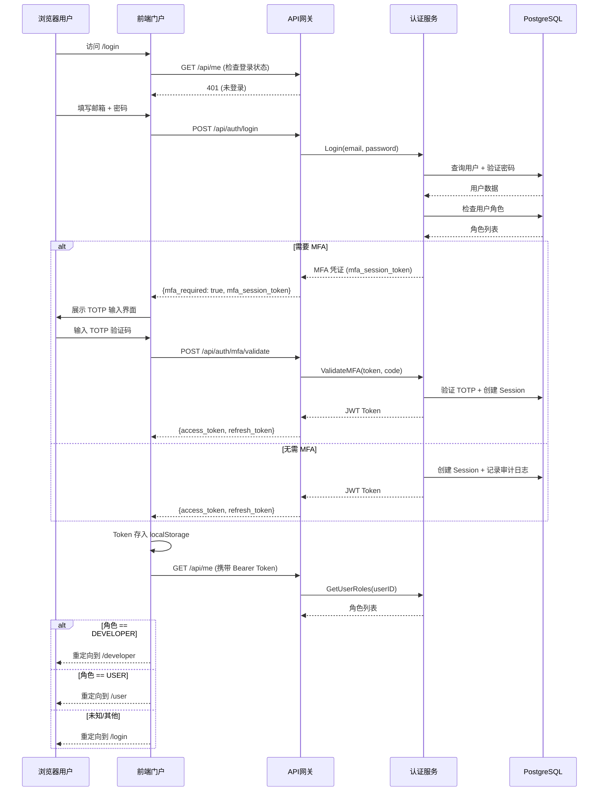
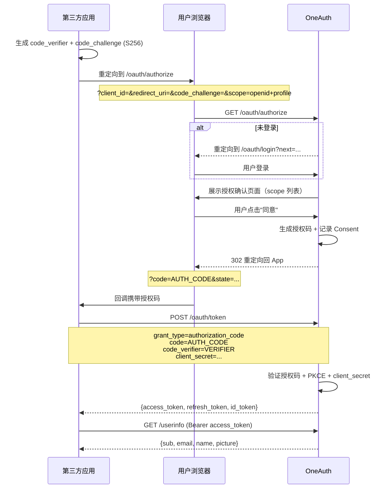

# 架构设计

## 概述

OneAuth 是一个企业级统一身份认证与授权管理（IAM）平台，遵循 OAuth 2.1 + OpenID Connect 协议标准。它使平台运营方能够统一管理用户认证、角色权限和第三方应用授权，使终端用户通过统一入口登录后按角色自动路由到对应门户，使开发者能够注册 OAuth 应用并集成 OIDC 认证到自己的服务中。

系统采用**后端微服务 + 前端多门户**的架构模式。后端以 Go 语言实现，通过单一 Gin HTTP 服务器暴露约 100 个 REST API 端点，同时并用 gRPC 服务器提供内部 RPC 调用；前端以 Next.js 15 构建四个独立应用（认证门户、账户中心、开发者控制台、管理控制台），通过 pnpm monorepo 统一管理。系统同时提供了一个独立的 Go SDK，供第三方 Go 服务集成 OAuth 认证。

## 技术栈

**语言与运行时**
- Go 1.24+ — 后端服务
- TypeScript 5.x — 前端应用
- Protocol Buffers — 接口定义

**后端框架与库**
- Gin — HTTP 路由框架
- Ent ORM — 数据库 ORM (代码生成，28 个实体)
- gRPC — 内部 RPC 通信
- Viper — 配置管理
- Zap — 结构化日志

**身份认证与安全**
- JWT RS256 — 令牌签名（运行时生成 RSA 密钥对）
- Argon2id — 密码哈希
- TOTP (RFC 6238) — 多因素认证
- PKCE S256 — OAuth 授权码增强
- Refresh Token Rotation — 刷新令牌轮换
- HMAC SHA256 — Webhook 签名

**数据存储**
- PostgreSQL 16 — 主数据库（Ent ORM + 自动迁移）
- Redis 7 — 缓存（预留）

**前端**
- Next.js 15 (App Router) — Web 框架
- React 19 — UI 库
- pnpm + Turborepo — Monorepo 管理
- TanStack Query 5 — 数据请求（预留）
- Zustand 5 — 状态管理（预留）
- Lucide React — 图标库
- Barlow — 管理后台字体

**基础设施**
- Systemd + Nginx — 生产部署
- Make — 后端构建

## 项目结构

```
/workspace/
├── cmd/server/main.go          # 后端入口
├── config/                     # 配置文件
│   ├── config.go               # Go 配置结构体
│   └── config.yaml             # 运行时配置
├── internal/                   # 后端核心代码
│   ├── auth/                   # 认证业务逻辑（12 个服务）
│   ├── ent/                    # Ent ORM 代码（28 个实体）
│   │   └── schema/             # Ent Schema 定义
│   ├── gateway/                # HTTP 网关（路由 + 处理器）
│   ├── middleware/             # Gin 中间件
│   ├── oauth2/                 # OAuth 2.1 协议实现
│   └── pkg/                    # 基础设施工具包
│       ├── crypto/             # Argon2id + PKCE
│       ├── email/              # 邮件发送
│       ├── jwt/                # JWT TokenManager
│       └── totp/               # TOTP 生成验证
├── proto/                      # Protobuf 定义
├── sdk/identity/               # Go SDK（独立 go module）
├── web/                        # 前端 Monorepo
│   ├── apps/
│   │   ├── auth-web/           # 认证门户（主入口，端口 3001）
│   │   ├── account-center/     # 账户中心
│   │   ├── admin-console/      # 管理控制台
│   │   └── developer-console/  # 开发者控制台
│   └── packages/shared/        # 共享包
├── Makefile
├── go.mod
└── start-demo.sh
```

**入口点**
- `cmd/server/main.go` — 后端服务启动（HTTP + gRPC）
- `web/apps/auth-web/src/app/page.tsx` — 前端认证门户首页
- `sdk/identity/client.go` — SDK 客户端入口

## 子系统

### 认证服务（Auth Service）
**目的**: 用户注册、登录、登出、MFA 验证、密码管理、邮箱验证
**位置**: `internal/auth/`
**关键文件**: `service.go`, `mfa.go`, `backupcode.go`, `verification.go`
**依赖**: Ent Client, JWT TokenManager, Email Sender, Redis
**被依赖**: Gateway 层（handler 调用）

### 网关层（Gateway）
**目的**: HTTP API 路由、请求参数解析、响应序列化、调用认证服务
**位置**: `internal/gateway/`
**关键文件**: `router.go`（路由定义）, `handler.go`（认证相关处理器）, `user_handlers.go`（用户资源处理器）, `admin.go`, `admin_enhanced.go`（管理处理器）, `grpc.go`（gRPC 服务器）
**依赖**: 所有 Service 层
**被依赖**: `cmd/server/main.go`

### OAuth 2.1 服务（OAuth2 Service）
**目的**: 实现 OAuth 2.1 授权码流程、Token 颁发/刷新/撤销、OIDC UserInfo、应用管理
**位置**: `internal/oauth2/`
**关键文件**: `service.go`
**依赖**: Ent Client, JWT TokenManager
**被依赖**: Gateway 层（handler 调用）

### Ent 数据模型层（Ent Schema Layer）
**目的**: 定义 28 个数据库实体及其关系、自动迁移
**位置**: `internal/ent/schema/`
**关键文件**: 每个实体一个 `.go` 文件（User, Role, Session, OAuthClient 等）
**依赖**: PostgreSQL
**被依赖**: 所有 Service 层

### 中间件层（Middleware）
**目的**: 请求日志、CORS、JWT 认证、Admin 认证、角色鉴权、速率限制（预留）
**位置**: `internal/middleware/`
**关键文件**: `middleware.go`
**依赖**: JWT TokenManager, Ent Client
**被依赖**: Gateway 层（路由注册）

### 前端认证门户（Auth Web）
**目的**: 统一的用户登入入口、OAuth 授权确认页面，包含三个独立身份的门户
**位置**: `web/apps/auth-web/`
**关键文件**: `page.tsx`（首页）, `login/page.tsx`（登录）, `oauth/page.tsx`（授权确认）
**依赖**: 后端 API（通过 Next.js rewrites 代理）
**被依赖**: 终端用户

### Go SDK
**目的**: 为第三方 Go 服务提供 OAuth 2.1 客户端集成能力
**位置**: `sdk/identity/`
**关键文件**: `client.go`（OAuth 客户端）, `middleware.go`（Gin 中间件）, `verifier.go`（JWKS 验证器）
**依赖**: 后端 OAuth API

## 架构图

### 系统架构概览

```mermaid
flowchart TB
    subgraph 外部客户端
        Browser["浏览器/SPA"]
        ThirdParty["第三方 Go 服务"]
        ExternalApp["外部 OAuth 应用"]
    end

    subgraph 前端层
        AuthWeb["认证门户 :3001"]
        AccountCenter["账户中心"]
        AdminConsole["管理控制台"]
        DevConsole["开发者控制台"]
    end

    subgraph API网关层
        Gin["Gin HTTP :9898"]
        Middleware["中间件链<br/>Logger/CORS/JWTAuth/RequireRole"]
        GRPC["gRPC :9090"]
    end

    subgraph 业务服务层
        AuthSvc["Auth Service<br/>注册/登录/MFA/角色"]
        OAuth2Svc["OAuth2 Service<br/>授权/Token/OIDC"]
        SecuritySvc["Security Service<br/>IP黑白名单/暴力破解"]
        OrgSvc["Organization Service"]
        RBACSvc["RBAC Service"]
        WebhookSvc["Webhook Service"]
    end

    subgraph 基础设施
        JWT["JWT TokenManager<br/>RS256 签名"]
        Argon2["Argon2id 密码哈希"]
        TOTP["TOTP 双因素认证"]
        Email["邮件发送"]
    end

    subgraph 数据层
        PG[("PostgreSQL 16<br/>Ent ORM - 28 个实体")]
        Redis[("Redis 7<br/>(预留)"]
    end

    Browser --> AuthWeb
    Browser --> AccountCenter
    Browser --> AdminConsole
    Browser --> DevConsole

    AuthWeb --> Gin
    ThirdParty --> Gin
    ThirdParty -->|SDK| OAuth2Svc
    ExternalApp --> Gin

    Gin --> Middleware --> AuthSvc
    Gin --> Middleware --> OAuth2Svc
    Gin --> Middleware --> SecuritySvc
    Gin --> Middleware --> OrgSvc
    Gin --> Middleware --> RBACSvc
    Gin --> Middleware --> WebhookSvc

    OAuth2Svc --> JWT
    AuthSvc --> JWT
    AuthSvc --> Argon2
    AuthSvc --> TOTP
    AuthSvc --> Email

    AuthSvc --> PG
    OAuth2Svc --> PG
    SecuritySvc --> PG
    OrgSvc --> PG
    RBACSvc --> PG
    WebhookSvc --> PG
    AuthSvc --> Redis
```

### 用户认证流程



### OAuth 2.1 授权码 + PKCE 流程



## 关键流程

### 用户注册流程
1. 前端收集邮箱 + 用户名 + 密码
2. 后端验证邮箱是否已存在（已存在则静默返回成功，防止用户枚举）
3. 使用 Argon2id 哈希密码
4. 事务创建 User + PasswordCredential + UserProfile
5. 自动分配 USER 角色（通过 AssignUserRole）
6. 记录审计日志（REGISTER 操作）
7. 返回用户 ID 和成功消息

### 多因素认证（MFA）流程
1. 用户登录时检测到 `mfa_enabled = true`
2. 服务端生成 `mfa_session_token`（不签发最终 JWT）
3. 前端展示 TOTP 验证码输入界面
4. 用户提交 TOTP 码 + `mfa_session_token`
5. 服务端验证 TOTP，创建 Session，记录角色和 login_type
6. 签发 access_token + refresh_token

### OAuth 应用创建流程
1. DEVELOPER 角色用户提交应用名称 + 描述 + 重定向 URI
2. 服务端生成 client_id（随机）和 client_secret（强随机）
3. client_secret 经 SHA256 哈希后存储（原文仅创建时返回一次）
4. 存储重定向 URI 列表到 OAuthRedirectURI 表
5. 返回 client_id 和 client_secret（需开发者立即保存）

### 角色鉴权流程
1. 请求抵达路由时，`JWTAuth` 中间件验证 JWT 并设置 `user_id` 到 context
2. `RequireRole` 中间件从 context 读取 `user_id`
3. 查询 `user_roles` 联表，获取用户的所有角色名
4. 用户角色与路由允许的角色列表比对
5. 匹配则放行，不匹配返回 403

## 设计决策

| 决策 | 选择 | 理由 |
|------|------|------|
| RBAC 模型 | 独立 `user_roles` 关联表 | 支持多角色、可查询、便于未来扩展 |
| 角色存储 | 运行时查询 DB（非 JWT 内嵌） | 角色变更无需刷新 Token |
| 密码哈希 | Argon2id | 抗 GPU/ASIC 暴力破解 |
| JWT 签名 | RS256（运行时生成密钥对） | 非对称签名，支持 JWKS 公钥分发 |
| Refresh Token | Family-based Rotation + Reuse 检测 | 防止 Refresh Token 泄露后的长期滥用 |
| Session 管理 | 数据库持久化 + 可撤销 | 支持管理员强制登出、设备管理 |
| 管理员认证 | 独立静态凭据（非 DB 用户） | 防止管理员账号被误删，独立于用户系统 |
| OAuth 登录隔离 | 独立 `/oauth/login` 端点 | DEVELOPER/ADMIN 禁止通过 OAuth 流程登录 |
| 前端布局 | 三个独立受保护 Layout | 按角色隔离 UI，无跨门户链接 |
| 双设计系统 | CC（用户端）+ DD（管理端） | 不同用户群体有不同视觉体验 |
| 数据库迁移 | Ent AutoMigration | 开发期快速迭代，生产可切换为手动迁移 |
