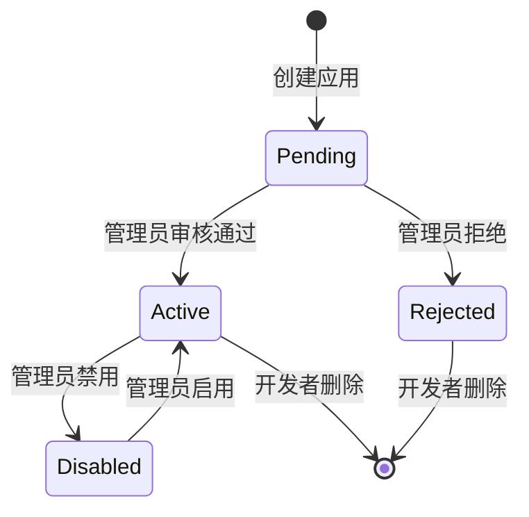
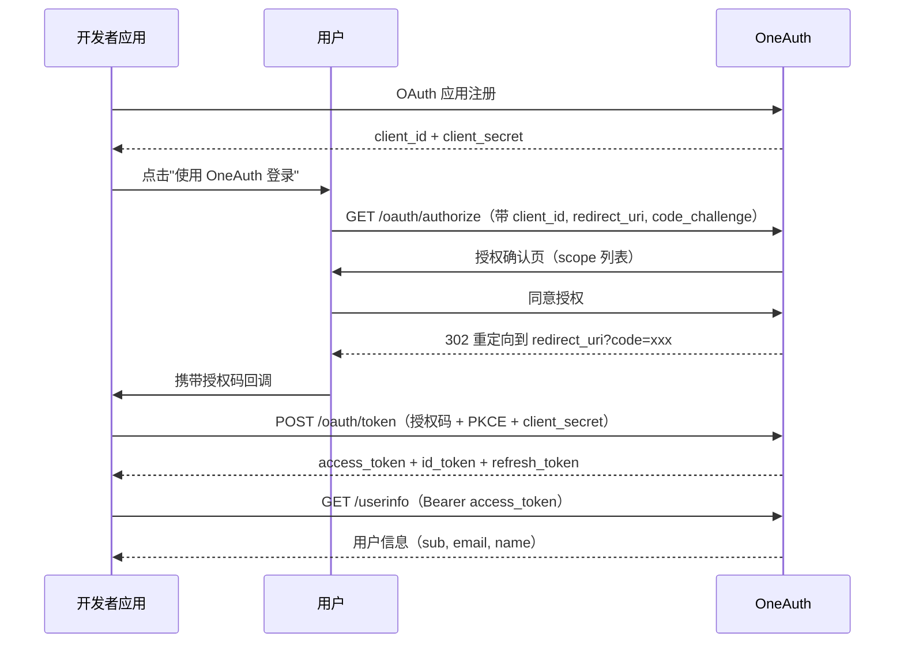

# OAuth 应用（OAuthClient）

OAuthClient 代表一个已在 OneAuth 注册的第三方 OAuth 2.1 应用。开发者通过创建 OAuth 应用获得 `client_id` 和 `client_secret`，然后使用 OAuth 2.1 协议将用户的 OneAuth 身份集成到自己的应用中。

## 什么是 OAuthClient？

OAuthClient 是第三方应用在 OneAuth 中的注册记录。每个应用拥有唯一 `client_id`、可轮换的 `client_secret`、一组受信重定向 URI 和状态（active/disabled）。应用支持 `confidential` 客户端类型，使用授权码 + PKCE 流程与 OneAuth 交互。

**关键特征**:
- 每个 DEVELOPER 角色用户可以创建和管理多个应用
- 应用需管理员审核后才能激活
- client_secret 仅创建或轮换时可见一次（SHA256 哈希存储）
- 支持 OAuth 2.1 授权码流程 + PKCE S256
- 支持 OpenID Connect（openid, profile, email 等 scope）

## 代码位置

| 方面 | 位置 |
|------|------|
| 模型 | `internal/ent/schema/oauthclient.go` |
| 服务 | `internal/oauth2/service.go` |
| API 路由 | `internal/gateway/router.go`（/api/apps/*） |
| Handler | `internal/gateway/handler.go`（OAuthApp handlers） |
| 数据库 | `oauth_clients`, `oauth_redirect_uris`, `oauth_consents`, `oauth_scopes` 表 |

## 结构

```go
type OAuthClient struct {
    ID               uuid.UUID
    ClientID         string       // 客户端标识符（唯一）
    Name             string       // 应用名称
    Description      string       // 应用描述
    ClientType       string       // confidential / public
    ClientSecretHash string       // client_secret 的 SHA256 哈希（敏感）
    Status           string       // active / disabled
    CreatedBy        uuid.UUID    // 创建者用户 ID
    CreatedAt        time.Time
    UpdatedAt        time.Time
}
```

### 关联实体

| 实体 | 关系 | 说明 |
|------|------|------|
| OAuthRedirectURI | 1:N | 受信重定向 URI 列表 |
| OAuthConsent | 1:N | 用户授权记录 |
| AuthorizationCode | 1:N | 授权码 |
| RefreshToken | 1:N | 刷新令牌 |

## 生命周期



## Scope 系统

OneAuth 通过预定义和自定义的 OAuth Scope 来控制第三方应用可访问的用户数据范围：

| Scope | 说明 | 返回数据 |
|-------|------|---------|
| `openid` | OpenID Connect（必需） | sub（用户 ID） |
| `profile` | 用户基本资料 | name, preferred_username |
| `email` | 邮箱信息 | email, email_verified |
| 自定义 | 管理员自定义 scope | 由具体定义决定 |

## 授权流程



## 密钥管理

- `client_secret` 使用 32 字节 `crypto/rand` 生成
- 存储时使用 SHA256 哈希，原文仅创建和轮换时返回一次
- 支持通过 `/api/apps/:id/rotate-secret` 轮换密钥，旧密钥立即失效
