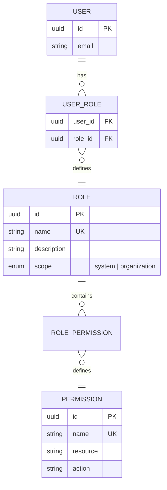
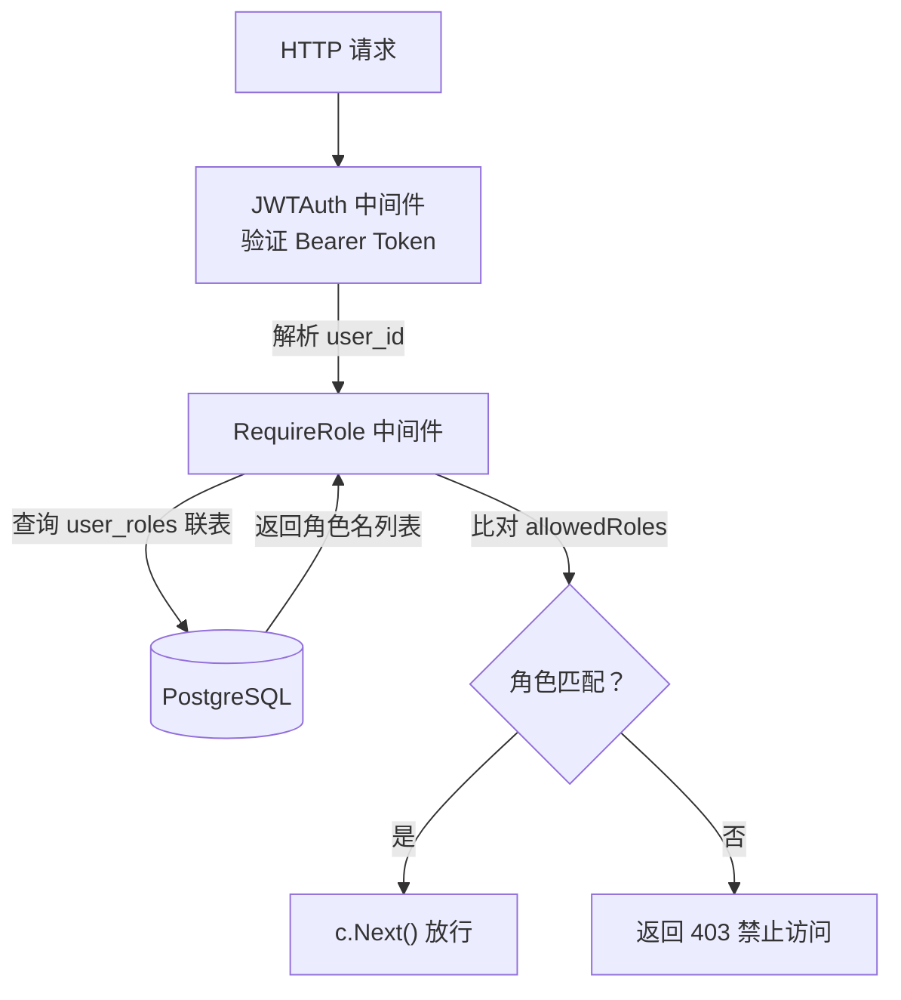

# 角色与 RBAC

RBAC（Role-Based Access Control）是 OneAuth 的权限控制模型。系统通过用户-角色关联和角色-权限关联两层结构实现灵活且可扩展的权限管理。

## 什么是 RBAC？

RBAC 代表基于角色的访问控制。OneAuth 使用一个可组合的角色系统：用户拥有一个或多个角色，角色拥有一组权限，权限定义了对特定资源的操作能力。系统预置了 4 个基础角色（USER, DEVELOPER, ADMIN, SUPER_ADMIN），管理员可以通过 RBAC API 创建自定义角色和权限。

**关键特征**:
- 用户-角色多对多关联（通过 `user_roles` 中间表）
- 角色-权限多对多关联（通过 `role_permissions` 中间表）
- 4 个预置系统角色，scope = system
- 支持自定义组织级角色（scope = organization）
- 运行时查询角色（不嵌入 JWT），角色变更即时生效

## 代码位置

| 方面 | 位置 |
|------|------|
| 角色模型 | `internal/ent/schema/role.go` |
| 权限模型 | `internal/ent/schema/permission.go` |
| 用户-角色模型 | `internal/ent/schema/userrole.go` |
| RBAC 服务 | `internal/auth/rbac.go` |
| 角色鉴权中间件 | `internal/middleware/middleware.go`（RequireRole） |
| 角色播种 | `cmd/server/main.go`（seedRoles） |
| 角色分配 | `internal/auth/service.go`（AssignUserRole） |

## 预置角色

| 角色 | 描述 | 可访问资源 |
|------|------|-----------|
| USER | 具有基本平台访问权限的普通用户 | `/api/user/*`（个人资料、MFA、设备、会话等） |
| DEVELOPER | 可管理 OAuth 应用的开发者 | 以上全部 + `/api/apps/*`, `/api/webhooks/*` |
| ADMIN | 具有完全系统访问权限的管理员 | `/api/admin/*`（用户、应用、审计、组织等） |
| SUPER_ADMIN | 无限制访问的超级管理员 | 全部（未来扩展高级操作） |

## 结构



### Role 结构

```go
type Role struct {
    ID             uuid.UUID
    Name           string       // 角色名，唯一（USER, DEVELOPER 等）
    Description    string       // 角色描述
    Scope          string       // 作用域: system / organization
    OrganizationID *uuid.UUID   // 组织 ID（仅 organization 作用域时）
    CreatedAt      time.Time
}
```

### Permission 结构

```go
type Permission struct {
    ID          uuid.UUID
    Name        string    // 权限名，唯一
    Description string
    Resource    string    // 资源类型（user, app, session 等）
    Action      string    // 操作（read, write, delete, admin 等）
}
```

## 鉴权流程



## RBAC 服务 API

| 方法 | 说明 |
|------|------|
| `AssignUserRole(userID, roleName)` | 为用户分配角色 |
| `GetUserRoles(userID)` | 查询用户所有角色名 |
| `HasRole(userID, roleName)` | 判断用户是否拥有某角色 |
| `CreateRole(name, description, scope)` | 创建新角色 |
| `ListRoles()` | 列出所有角色 |
| `DeleteRole(roleID)` | 删除角色 |
| `CreatePermission(name, resource, action)` | 创建新权限 |
| `ListPermissions()` | 列出所有权限 |
| `DeletePermission(permissionID)` | 删除权限 |
| `AssignPermissions(roleID, permissionIDs)` | 为角色分配权限 |
| `GetRolePermissions(roleID)` | 查询角色的权限列表 |
