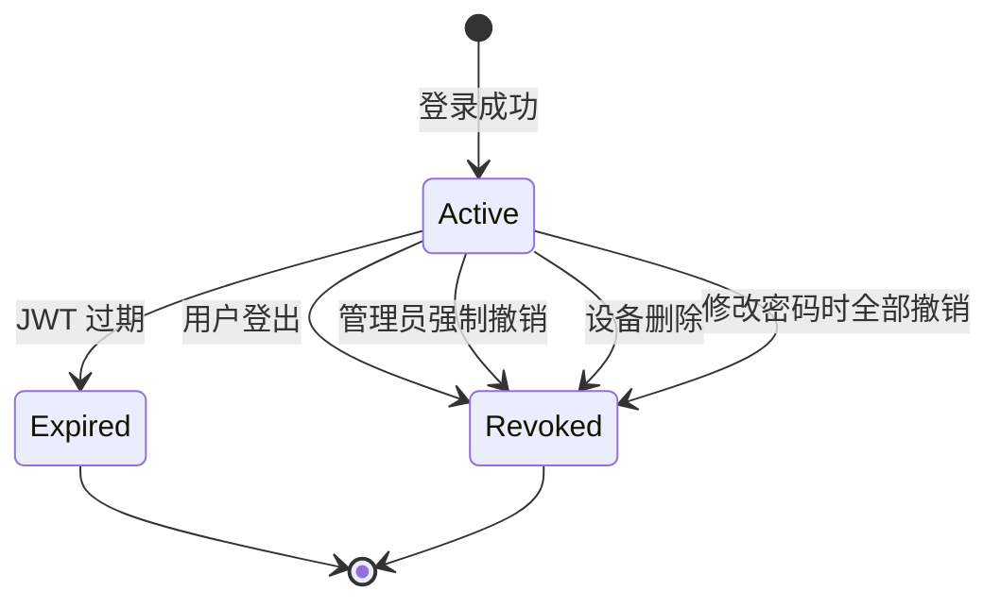

# 会话（Session）

Session 代表用户的一次登录会话，记录了设备信息、IP 地址、登录类型和角色信息。OneAuth 将会话持久化到数据库，支持服务端撤销和全局活跃会话管理。

## 什么是 Session？

Session 是用户登录成功后创建的一条记录，包含 `token_hash`（登录时签发 JWT 的 hash）、设备标识、IP 地址、用户代理以及当前会话绑定的角色和登录类型。会话可被用户自己（通过设备管理或会话管理页面）或管理员强制撤销。

**关键特征**:
- 每次用户登录（包括 MFA 验证后）创建一个 session 记录
- 服务端持久化，支持撤销（revoke）和过期
- 使用 `login_type` 区分普通登录、OAuth 登录、开发者登录和管理员登录
- 记录当前 session 绑定的角色，用于审计

## 代码位置

| 方面 | 位置 |
|------|------|
| 模型 | `internal/ent/schema/session.go` |
| 创建 | `internal/auth/service.go`（Login, ValidateMFA） |
| 撤销 | `internal/auth/service.go`（Logout） |
| 管理 API | `internal/gateway/user_handlers.go`（ListSessions, RevokeSession） |
| 管理员 API | `internal/gateway/admin_enhanced.go`（AdminListAllSessions, AdminDeleteSession） |
| 数据库 | `sessions` 表 |

## 结构

```go
type Session struct {
    ID           uuid.UUID
    UserID       uuid.UUID      // 所属用户
    TokenHash    string         // JWT 令牌的 SHA256 哈希（唯一）
    DeviceID     *uuid.UUID     // 关联设备（可选）
    IPAddress    string         // 登录时的 IP 地址
    UserAgent    string         // 用户代理字符串
    Status       SessionStatus  // active / revoked / expired
    Role         string         // 当前会话绑定的角色
    LoginType    LoginType      // normal / oauth / developer / admin
    ExpiresAt    time.Time      // 过期时间
    LastActiveAt time.Time      // 最后活跃时间
    RevokedAt    *time.Time     // 撤销时间
    CreatedAt    time.Time
}
```

## LoginType 枚举

| 值 | 来源 | 说明 |
|----|------|------|
| `normal` | `/api/auth/login` | 标准平台登录 |
| `oauth` | `/api/auth/oauth/login` | OAuth 第三方应用登录 |
| `developer` | `/api/auth/login`（DEVELOPER 角色） | 开发者登录 |
| `admin` | `/api/admin/login` | 管理员配置凭据登录 |

## 生命周期



## 安全管理

- **登出**: 用户显式登出时撤销当前 session
- **密码重置**: 重置密码后撤销用户所有活跃 session
- **设备管理**: 删除设备时同时撤销关联的所有 session
- **管理员操作**: 管理员可查看全部活跃 session 并强制撤销
- **Token Hash**: 数据库中仅存储 Token 的 SHA256 哈希，原文不可恢复
