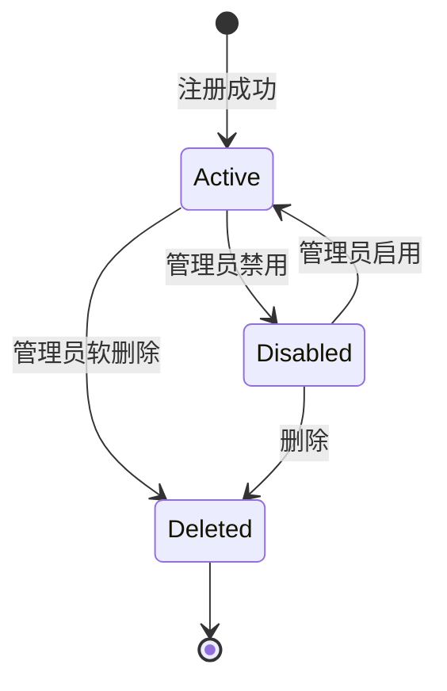

# 用户（User）

用户是 OneAuth 平台的核心实体，代表一个可以使用平台服务和 OAuth 认证的个人。每个用户拥有密码凭据、个人资料、角色、MFA 设置、设备和会话。

## 什么是 User？

User 代表一个已注册的平台账户。用户通过邮箱注册，系统自动创建相关联的 PasswordCredential、UserProfile 和默认 USER 角色。用户可以启用 MFA、管理多邮箱和手机号、创建个人访问令牌。

**关键特征**:
- 通过邮箱注册并登录
- 拥有独立的密码凭据（Argon2id 加密）
- 可绑定多个邮箱和手机号
- 可启用 TOTP 双因素认证
- 可拥有一个或多个角色（通过 user_roles 关联表）

## 代码位置

| 方面 | 位置 |
|------|------|
| 模型 | `internal/ent/schema/user.go` |
| 服务 | `internal/auth/service.go` |
| API 路由 | `internal/gateway/router.go`（/api/user/*） |
| Handler | `internal/gateway/handler.go`, `internal/gateway/user_handlers.go` |
| 数据库 | `users` 表 |

## 结构

```go
type User struct {
    ID            uuid.UUID      // 主键，UUIDv4
    Email         string         // 登录邮箱（唯一）
    Username      string         // 用户名（可选，唯一）
    Phone         string         // 手机号（可选）
    EmailVerified bool           // 邮箱是否已验证
    MfaEnabled    bool           // 是否启用 MFA
    MfaSecret     string         // TOTP 密钥（敏感数据）
    Status        UserStatus     // active / disabled / pending
    CreatedAt     time.Time
    UpdatedAt     time.Time
    DeletedAt     *time.Time     // 软删除
}
```

### 关联实体

| 实体 | 关系 | 说明 |
|------|------|------|
| PasswordCredential | 1:1 | Argon2id 密码哈希 |
| UserProfile | 1:1 | 显示名、头像、地区、时区 |
| Session | 1:N | 登录会话 |
| Device | 1:N | 受信任设备 |
| AuditLog | 1:N | 审计操作记录 |
| OAuthConsent | 1:N | OAuth 应用授权记录 |
| RefreshToken | 1:N | 刷新令牌 |
| PersonalToken | 1:N | 个人访问令牌 |
| BackupCode | 1:N | MFA 备用恢复码 |
| UserEmail | 1:N | 额外邮箱 |
| UserPhone | 1:N | 手机号 |
| Role | M:N | 用户角色（通过 user_roles） |

## 不变量

1. **邮箱唯一性**: 每个邮箱只能注册一个账户
2. **注册幂等性**: 已存在的邮箱再次注册返回成功（不暴露存在信息）
3. **软删除**: 删除用户为软删除（deleted_at 标记）
4. **密码安全**: 密码最小长度 8 字符，使用 Argon2id 哈希

## 生命周期



## 角色系统

用户通过 `user_roles` 关联表与角色关联，支持多角色。注册时自动分配 USER 角色。其他角色需要管理员手动分配或特定条件触发。
