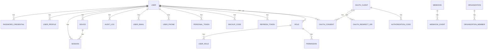

# Ent ORM 数据模型层

OneAuth 使用 Ent ORM（entgo.io）管理全部数据库操作。数据模型定义了 28 个实体，涵盖用户身份、认证凭据、会话、OAuth 协议、RBAC 权限、组织和 Webhook 等所有业务领域。

## 实体列表

### 认证核心 (6)

| 实体 | 表名 | 说明 |
|------|------|------|
| User | `users` | 平台用户，基础身份实体 |
| PasswordCredential | `password_credentials` | Argon2id 密码哈希，1:1 关联 User |
| UserProfile | `user_profiles` | 个人资料，1:1 关联 User |
| Session | `sessions` | 登录会话，含角色和登录类型 |
| Device | `devices` | 受信任设备 |
| LoginAttempt | `login_attempts` | 登录尝试记录（用于暴力破解检测） |

### RBAC (3)

| 实体 | 表名 | 说明 |
|------|------|------|
| Role | `roles` | 角色定义（USER, DEVELOPER, ADMIN, SUPER_ADMIN） |
| Permission | `permissions` | 权限定义（resource + action） |
| UserRole | `user_roles` | 用户-角色多对多关联表 |

### OAuth 2.1 (5)

| 实体 | 表名 | 说明 |
|------|------|------|
| OAuthClient | `oauth_clients` | OAuth 应用注册 |
| OAuthRedirectURI | `oauth_redirect_uris` | 应用受信重定向 URI |
| OAuthConsent | `oauth_consents` | 用户授权同意记录 |
| OAuthScope | `oauth_scopes` | OAuth 权限范围定义 |
| AuthorizationCode | `authorization_codes` | 授权码（含 PKCE challenge） |

### Token 相关 (4)

| 实体 | 表名 | 说明 |
|------|------|------|
| RefreshToken | `refresh_tokens` | 刷新令牌（Family-based Rotation） |
| PersonalToken | `personal_tokens` | 用户个人访问令牌 |
| SigningKey | `signing_keys` | JWT 签名密钥记录 |
| BackupCode | `backup_codes` | MFA 备用恢复码 |

### 验证码 (2)

| 实体 | 表名 | 说明 |
|------|------|------|
| EmailVerificationToken | `email_verification_tokens` | 邮箱验证令牌 |
| PasswordResetToken | `password_reset_tokens` | 密码重置令牌 |

### 组织 (2)

| 实体 | 表名 | 说明 |
|------|------|------|
| Organization | `organizations` | 组织 |
| OrganizationMember | `organization_members` | 组织成员 |

### 附加功能 (5)

| 实体 | 表名 | 说明 |
|------|------|------|
| UserEmail | `user_emails` | 多邮箱管理 |
| UserPhone | `user_phones` | 手机号管理 |
| AuditLog | `audit_logs` | 审计日志 |
| IPRule | `ip_rules` | IP 黑白名单规则 |
| SystemConfig | `system_configs` | 系统配置 KV 存储 |

### Webhook (2)

| 实体 | 表名 | 说明 |
|------|------|------|
| Webhook | `webhooks` | Webhook 配置 |
| WebhookEvent | `webhook_events` | Webhook 事件发送记录 |

## 核心实体关系图



## 关键设计

- **软删除**: User 和 Organization 支持 DeletedAt 逻辑删除
- **敏感字段**: PasswordHash, MfaSecret, ClientSecretHash, TokenHash 标记为 sensitive
- **唯一约束**: 关键字段（email, username, client_id, name 等）有唯一索引
- **复合索引**: user_roles (user_id+role_id)、user_devices (user_id+fingerprint) 等
- **自动迁移**: 应用启动时通过 `db.Schema.Create()` 执行 Ent AutoMigration

## 代码生成

```bash
# 修改 Schema 定义后重新生成
make ent

# Ent 会生成:
# internal/ent/           — 客户端和事务
# internal/ent/[entity]/ — 每个实体的 CRUD 操作
# internal/ent/migrate/  — 迁移代码
```
