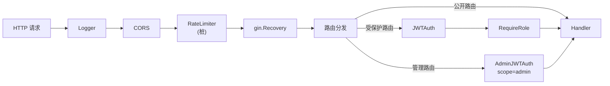
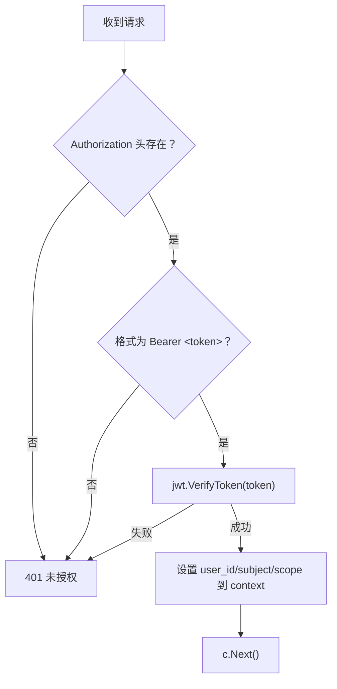
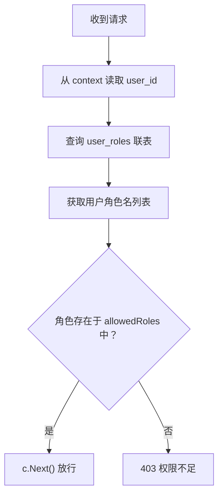

# 中间件层（Middleware）

中间件层基于 Gin 框架提供 HTTP 请求的横切关注点处理，包括请求日志、跨域支持、JWT 认证、角色鉴权和速率限制。

## 结构

```
internal/middleware/
└── middleware.go       # 全部中间件定义
```

## 中间件列表

| 中间件 | 用途 | 应用于 |
|--------|------|--------|
| `Logger(logger)` | 记录 method/path/status/latency/IP/UA | 全局 |
| `CORS()` | 跨域支持，允许所有来源 | 全局 |
| `RateLimiter()` | 速率限制（当前为桩函数，未实现） | 全局 |
| `JWTAuth(jwt)` | 验证 Bearer JWT Token，设置 user_id/subject/scope | 受保护路由 |
| `AdminJWTAuth(jwt)` | 验证 Bearer JWT + 检查 scope=admin | 管理路由 |
| `JWTAuthOptional(jwt)` | 同 JWTAuth，但不拒绝未认证请求 | 授权端点 |
| `RequireRole(db, roles...)` | 查询 user_roles 表，比对角色列表 | 按角色分组路由 |

## 中间件链



## 认证流程

### JWTAuth 中间件



### RequireRole 中间件



### 角色路由映射

| 路由组 | 中间件 | 允许的角色 |
|--------|--------|-----------|
| `/api/user/*` | `JWTAuth → RequireRole(db, "USER", "DEVELOPER")` | USER, DEVELOPER |
| `/api/apps/*` | `JWTAuth → RequireRole(db, "DEVELOPER")` | DEVELOPER |
| `/api/webhooks/*` | `JWTAuth → RequireRole(db, "DEVELOPER")` | DEVELOPER |
| `/api/me` | `JWTAuth` | 任何已认证用户 |
| `/api/admin/*` | `AdminJWTAuth` | scope=admin |
| `/oauth/authorize` | `JWTAuthOptional` | 可选认证 |
