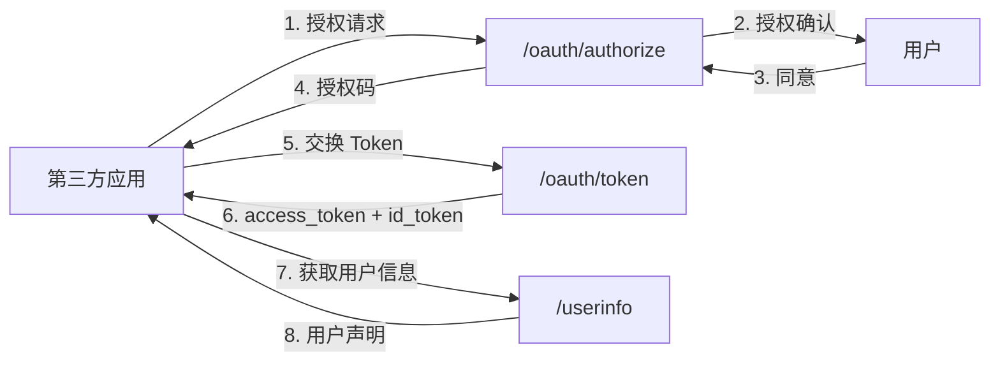

# OAuth 2.1 服务

OAuth 2.1 服务实现了完整的 OAuth 2.1 授权框架和 OpenID Connect 核心协议，包括授权码流程、PKCE、Token 颁发/刷新/撤销、UserInfo、Token Introspection 和 OAuth 应用管理。

## 结构

```
internal/oauth2/
└── service.go          # 完整的 OAuth 2.1 / OIDC 协议实现（583 行）
```

## 关键功能

| 功能 | 方法 | 说明 |
|------|------|------|
| 应用管理 | `CreateApp`, `GetApp`, `ListApps`, `UpdateApp` | OAuth 客户端 CRUD |
| 密钥管理 | `GenerateClientSecret` | client_secret 轮换 |
| 授权 | `Authorize` | 生成授权码，验证 PKCE challenge |
| Token | `Token` | 授权码交换 Token / Refresh Token 轮换 |
| OIDC | `UserInfo` | 返回用户标准 OIDC 声明 |
| Token 检查 | `Introspect` | RFC 7662 Token  introspection |
| Token 撤销 | `Revoke` | RFC 7009 Token 撤销 |
| 授权管理 | `ListUserAuthorizations`, `RevokeUserAuthorization` | 用户授权应用管理 |

## 依赖

**本模块依赖**:
- `internal/ent/` — OAuthClient、AuthorizationCode、RefreshToken 等实体
- `internal/pkg/crypto/` — PKCE 验证
- `internal/pkg/jwt/` — JWT 令牌生成

**依赖本模块的**:
- `internal/gateway/handler.go` — OAuth2 handler 调用
- `proto/oauth2/` — gRPC 服务注册

## OAuth 2.1 协议支持

### 授权码流程



### 安全特性

- PKCE (S256) — 强制要求授权码 + PKCE
- 授权码单次使用 + 10 分钟过期
- Refresh Token Rotation + Reuse 检测
- Client Secret SHA256 哈希存储
- 支持 Token 撤销（RFC 7009）
- 支持 Token Introspection（RFC 7662，用于资源服务器验证 Token）

### Token 格式

| Token 类型 | 签名算法 | 声明内容 | 有效期 |
|-----------|---------|---------|--------|
| Access Token | RS256 | user_id, client_id, scope, exp, iat | 15 分钟 |
| ID Token | RS256 | sub, email, email_verified, name, aud, exp, iat, iss | 15 分钟 |
| Refresh Token | SHA256 哈希 | family_id（数据库追踪） | 30 天 |
