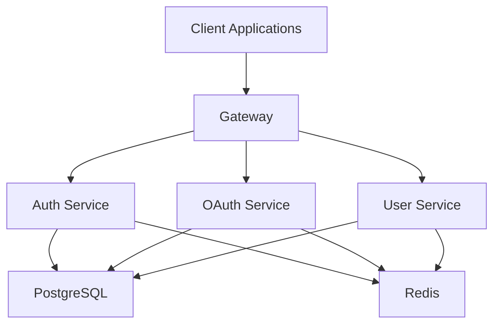
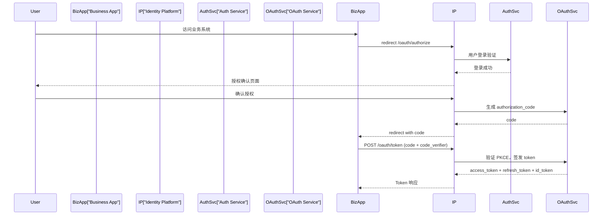

# Identity Platform 系统架构设计文档

Feature Name: unified-login
Updated: 2026-07-16

## 1. 项目目标

开发一个统一身份认证平台（Identity Platform），实现一个账号登录多个业务系统，提供统一用户中心和 OAuth 2.1 / OpenID Connect 登录能力，支持 Web、Mobile、第三方应用接入。

业务系统：IM 系统、社区系统、商城系统、AI 应用、管理后台。所有业务系统不能自行维护用户密码，统一接入 Identity Platform。

## 2. 技术栈

### Backend
- 语言：Go 1.24+
- HTTP Framework: Gin
- RPC: gRPC + Protocol Buffers
- ORM: Ent
- Database: PostgreSQL 16
- Cache: Redis 7
- Authentication: OAuth 2.1, OpenID Connect Core 1.0, PKCE, JWT RS256
- Logging: Zap
- Monitoring: OpenTelemetry
- Password: Argon2id

### Frontend
- Framework: Next.js 15
- Language: TypeScript
- UI: TailwindCSS + shadcn/ui
- State: TanStack Query + Zustand

## 3. 系统架构



## 4. 服务职责

### Gateway
- HTTP 入口、API 路由、鉴权、限流
- 不包含业务逻辑

### Auth Service
- 用户登录、注册、密码验证、Session 创建
- 邮箱验证、密码重置、MFA 验证

### User Service
- 用户资料、用户状态、用户信息查询

### OAuth Service
- OAuth Client 管理、Authorization Code 流程
- Access Token 签发、Refresh Token 管理
- ID Token 生成、OIDC Discovery

## 5. OAuth 2.1 / OIDC 设计

必须支持 OAuth 2.1 + OpenID Connect + Authorization Code Flow + PKCE。



## 6. Token 设计

### Access Token
- 格式：JWT
- 算法：RS256
- 有效时间：15 分钟
- Payload: `{ sub, scope, iss, aud, exp, iat }`

### Refresh Token
- 类型：随机字符串
- 有效时间：30 天
- 支持轮换、支持撤销

### ID Token
- OIDC 标准 JWT
- 包含：`iss, sub, aud, exp, iat, email, name`

## 7. OIDC 接口

| 方法 | 路径 | 说明 |
|------|------|------|
| GET | /.well-known/openid-configuration | Discovery |
| GET | /.well-known/jwks.json | JWKS |
| GET | /oauth/authorize | Authorization |
| POST | /oauth/token | Token |
| GET | /userinfo | UserInfo |

## 8. 数据库设计

### users
```
id, username, email, phone, password_hash(Argon2id), avatar, status, mfa_enabled, mfa_secret, email_verified, created_at, updated_at
```

### sessions
```
id, user_id, device_id, ip, user_agent, refresh_token_hash, expire_at, created_at
```

### devices
```
id, user_id, device_name, fingerprint, os, browser, last_ip, last_seen_at, created_at
```

### oauth_apps
```
id, client_id, client_secret_hash, name, description, homepage_url, redirect_uris, allowed_scopes, status, owner_id, created_at
```

### authorization_codes
```
id, client_id, user_id, code_hash, code_challenge, code_challenge_method, redirect_uri, scopes, expires_at, used, created_at
```

### access_tokens
```
id, user_id, client_id, token_hash, scope, expires_at, created_at
```

### refresh_tokens
```
id, user_id, client_id, token_hash, session_id, expires_at, revoked, created_at
```

### user_authorizations
```
id, user_id, client_id, scopes, created_at
```

### scopes
```
id, name, description, is_default, created_at
```
预置 Scope: `openid`, `profile`, `email`, `offline_access`, `chat.read`, `chat.write`

### audit_logs
```
id, user_id, action, detail(JSONB), ip_address, user_agent, result, created_at
```
记录：登录、登出、密码修改、MFA 操作、授权行为

## 9. 安全要求

- **密码安全**：Argon2id，禁止明文存储
- **MFA**：TOTP（兼容 Google Authenticator）
- **防护**：登录失败限制、IP 限制、Token 撤销、Session 管理、安全日志
- **PKCE**：Authorization Code Flow 强制 PKCE（S256）

## 10. 前端应用

| 应用 | 地址 | 功能 |
|------|------|------|
| auth-web | auth.example.com | 登录、注册、MFA 验证、OAuth 授权确认 |
| account-center | account.example.com | 用户资料、修改密码、MFA 管理、登录设备、已授权应用 |
| developer-console | developer.example.com | 创建 OAuth 应用、Client ID、Redirect URI、SDK 文档 |
| admin-console | admin.example.com | 用户管理、应用管理、审计查询、风控管理 |

## 11. 项目结构

```
identity-platform/
├── cmd/
│   └── server/              # 主入口
├── internal/
│   ├── gateway/             # Gateway: HTTP 路由、中间件、鉴权、限流
│   ├── auth/                # Auth Service: 登录/注册/密码/MFA
│   ├── oauth2/              # OAuth Service: 授权码/Token/OIDC
│   ├── user/                # User Service: 用户信息管理
│   ├── ent/                 # Ent ORM 生成代码
│   │   └── schema/          # Ent Schema 定义
│   ├── middleware/          # 共享中间件
│   └── pkg/                 # 通用工具
│       ├── jwt/
│       ├── totp/
│       ├── email/
│       └── crypto/
├── proto/                   # gRPC protobuf 定义
│   ├── auth.proto
│   ├── oauth2.proto
│   └── user.proto
├── web/                     # Next.js 15 前端
│   ├── apps/
│   │   ├── auth-web/
│   │   ├── account-center/
│   │   ├── developer-console/
│   │   └── admin-console/
│   └── packages/
│       └── shared/          # 共享 UI 组件和工具
├── sdk/                     # Go SDK
├── migrations/              # 数据库迁移
└── config/                  # 配置文件
```

## 12. 开发阶段

| Phase | 内容 | 交付物 |
|-------|------|--------|
| Phase 1 | 用户系统：注册、登录、Session | auth service + user service 基础功能 |
| Phase 2 | 安全系统：邮箱验证、密码重置、MFA、Device 管理 | 完整安全功能 |
| Phase 3 | OAuth/OIDC：Client 管理、Authorization Code + PKCE、Token、OIDC Discovery | 完整 OAuth 2.1 协议 |
| Phase 4 | Web 门户：Auth Web、Account Center、Developer Console、Admin Console | 四个前端应用 |
| Phase 5 | SDK：Go SDK + 示例项目 | SDK + 文档 |

## 13. 开发原则

1. 不修改技术栈
2. 不改变 OAuth/OIDC 协议设计
3. 不跳过安全功能
4. 优先完成 MVP
5. 所有接口必须有 API 文档
6. 所有数据库修改必须生成 migration
7. 所有核心逻辑必须有测试

## 14. 输出要求

- 必须提供完整文件路径
- 遵循 Go 项目结构
- 使用 Clean Architecture
- 添加错误处理
- 添加单元测试
- 添加 README 说明

禁止：生成伪代码、省略关键代码、自创认证协议、使用非标准 OAuth 流程。
